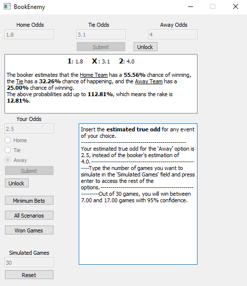

<a id="readme-top"></a>
<h3 align="center">Book Enemy</h3>

  <p align="center">
    Gain one against the booker.
    <br />


<!-- TABLE OF CONTENTS -->
<details>
  <summary>Table of Contents</summary>
  <ol>
    <li>
      <a href="#about-the-project">About The Project</a>
    </li>
    <li>
      <a href="#getting-started">Getting Started</a>
      <ul>
        <li><a href="#prerequisites">Prerequisites</a></li>
        <li><a href="#installation">Installation</a></li>
      </ul>
    </li>
    <li><a href="#usage">Usage</a></li>
    <li><a href="#license">License</a></li>
    <li><a href="#contact">Contact</a></li>
  </ol>
</details>


<!-- ABOUT THE PROJECT -->
## About The Project

This is a mini project focused on the concept of [value betting](https://en.everybodywiki.com/Value_betting). 
The pinnacle of value betting lies on examining offered bets and trying to assess the underlying relative frequency of the implied outcomes. Every time the bettor finds a discrepancy between the offered odd and his estimated relative frequency of the offered outcome, it is self-evident that this is a favorable bet and he should bet on it.
Most of the bettors, though, are not interested on winning a single event. It would be more preferable to be confident that one can mantain profit in the long-run, while following a value betting strategy. The solution to this problem is not trivial. One cannot just hope to find marginally better odds than what the booker estimates nor should hope that any arbitrary number of similar games is enough to net him a profit in a respectable confidence interval, just on intuition.
**Book Enemy** is a simple calculator that can quantify the odds of different offered odd/"true" (sic) odd scenarios and help bettors make informed decisions.

<p align="right">(<a href="#readme-top">back to top</a>)</p>


<!-- GETTING STARTED -->
## Getting Started

To get the latest local copy up and running follow these simple example steps. If you just want to run the last stable version, you can check the ***Releases*** section on the respective repository.

### Prerequisites

Refer to *requirements.txt*.

### Installation

1. Clone the repo
   ```sh
   git clone https://github.com/Kaizokugari1992/BookEnemy.git
   ```
2. Change git remote url to avoid accidental pushes to base project (optional)
   ```sh
   git remote set-url origin Kaizokugari1992/BookEnemy
   git remote -v # confirm the changes
   ```
 3. Make sure all the requirements are properly installed on your venv.
 
 4. Run <span>main.py</span>.

<p align="right">(<a href="#readme-top">back to top</a>)</p>


<!-- USAGE EXAMPLES -->
## Usage


**The main window**

<h6>Release 1.0.0. of BookEnemy</h6>

Inputs are pretty much self-explanatory. 

1. Insert all the offered odds of an event and press "Submit". Some basic information about the event will be generated.
2. Now you can insert your estimated odd, that better represents the true relative frequency of an outcome of the event. Choose the odd position and press "Submit".
3. There are three possible choices.
   - Calculate the minimum similar bets you need to make, so that you, at least, get your money back with a confidence of at least 95%. I made the confidence interval a function argument, so you can easily change it if you wish so. In future versions of <b>"Book Enemy"</b>, it is trivial to make a slider of the desired confidence interval.
   - Return all the possible win scenarios for a certain number of similar games. The scenarios will return the win/game ratio, the total profit/loss and the cumulative probability of the scenario, meaning this or something better (more profitable) happening. This, at the moment, assumes an equal bet of 100AU on every single bet.
   - Estimate how many wins you are projected to make in a certain number of similar games, for the designated confidence interval of 95%. Both this and the previous scenario, require from you to specify how many many games you want to simulate in the left lowermost entry field titled "Simulated Games". 

If the project gets significant traction, I might include a short introduction to the actual mathematics used to support our calculations. If you have some elementary knowledge of [Combinatronics](https://en.wikipedia.org/wiki/Combinatorics) and by extension the [Binomial Distribution](https://en.wikipedia.org/wiki/Binomial_distribution), you can pick apart the functions provided in <i>utils/function_base.py</i>. I can recommend "Hogg-McKean-Craig (2019). <i>Introduction to Mathematical Statistics</i>, (8th ed.). Pearson." for aspirants with a math/physics/engineering background.

If you have any suggestions or corrections to provide on the actual mathematics used, I would be more than happy to be corrected (this is an educational project after all). 

<p align="right">(<a href="#readme-top">back to top</a>)</p>

<!-- LICENSE -->
## License

Distributed under the **GNU General Public License v3.0**. See `LICENSE.txt` for more information.

<p align="right">(<a href="#readme-top">back to top</a>)</p>

<!-- CONTACT -->
## Contact

Email: kagias1992@gmail.com

Project Link: [https://github.com/Kaizokugari1992/BookEnemy](https://github.com/github_username/repo_name)

<p align="right">(<a href="#readme-top">back to top</a>)</p>
